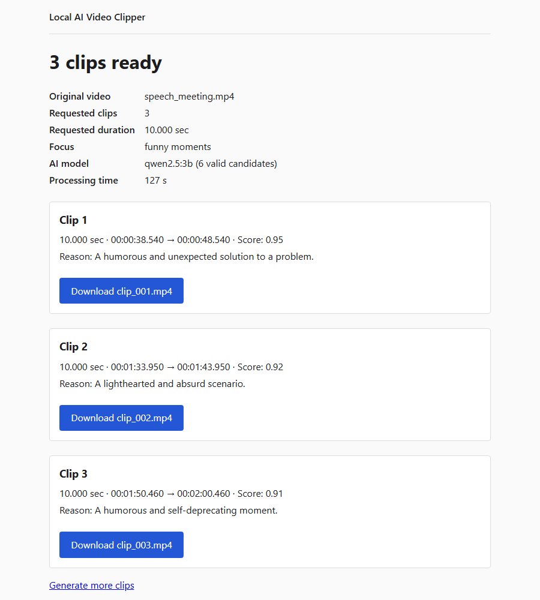
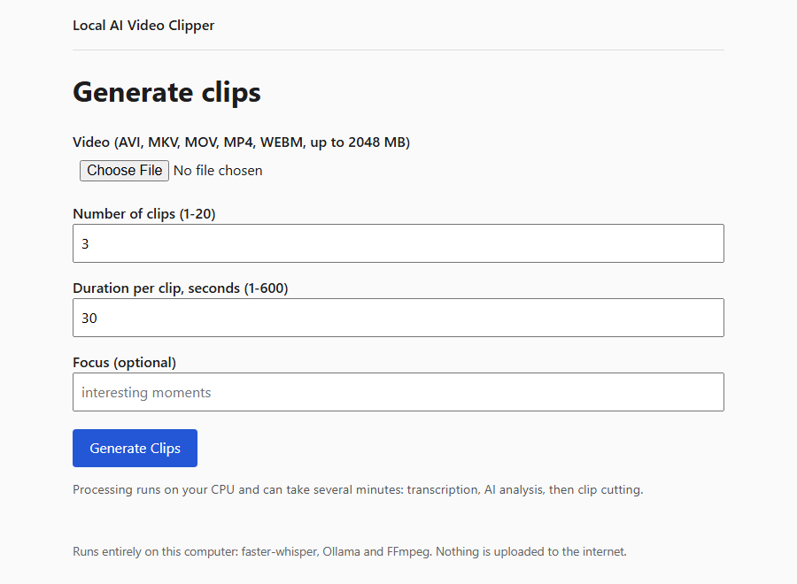
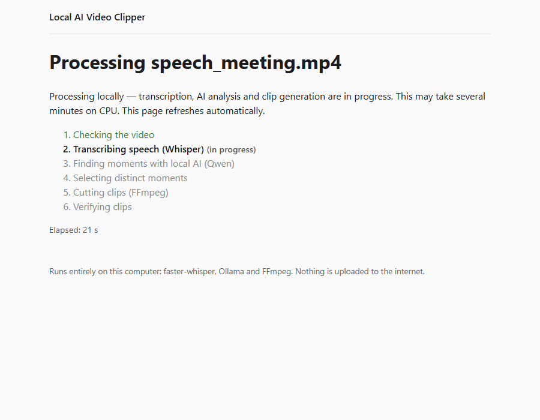
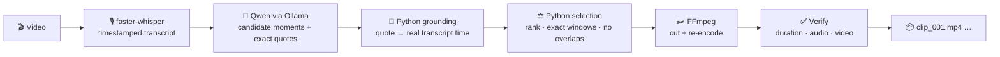

<div align="center">

# 🎬 Local AI Video Clipper

**Drop in a long video and get back the best moments as clips of exactly the length you asked for.
Everything runs on your own computer, and it costs $0.**




</div>

---

## ✨ What it does

You give it **a video**, **how many clips** you want, **how long each clip should be**, and optionally **what to
look for** (e.g. *"funny moments"*, *"key decisions"*, *"best explanations"*). It then:

1. 🎙️ **Transcribes** the speech locally with [faster-whisper](https://github.com/SYSTRAN/faster-whisper) (word-level timestamps)
2. 🧠 **Finds the moments** that match your request with a local LLM ([Qwen 2.5](https://ollama.com/library/qwen2.5) via [Ollama](https://ollama.com))
3. 📍 **Grounds** every AI suggestion in the real transcript, so a clip is never cut at a time the AI made up
4. ✂️ **Cuts** exactly-N, exactly-D-second MP4 clips with [FFmpeg](https://ffmpeg.org), and re-checks every one

| | |
|---|---|
| 💸 **$0 cost** | No paid APIs, no subscriptions, no cloud AI, no paid GPU |
| 🔒 **Private** | Your video never leaves your machine. The web UI only listens on `127.0.0.1` |
| 🎯 **Exact durations** | Clips are re-encoded frame-accurately and re-probed (measured error ≤ 0.023 s) |
| 🧾 **Honest results** | You get exactly the clips you asked for or a clear error. Nothing is padded, duplicated or invented |
| 🖥️ **CPU-only friendly** | Runs on an ordinary laptop: about 2 minutes for a 2.5-minute video |

## 📸 Screenshots

| 1. Choose a video and settings | 2. Live progress | 3. Download your clips |
|:---:|:---:|:---:|
|  |  |  |

The screenshots come from a real run: a 145 s meeting video, *3 clips × 10 s*, focus *"funny moments"*,
`qwen2.5:3b` on a laptop CPU, **127 s** in total. Each clip came out at exactly 10.000 s.

## 🚀 Quick start

> 📖 Detailed instructions for Windows, macOS and Linux, plus troubleshooting, are in **[docs/SETUP.md](docs/SETUP.md)**.

**You need:** Python 3.10+, [FFmpeg](https://ffmpeg.org/download.html), [Ollama](https://ollama.com/download), about 4 GB of free disk space.

```bash
git clone https://github.com/ayushrijal83-ops/video_scliser.git
cd video_scliser

python -m venv .venv
.venv\Scripts\activate            # Windows
# source .venv/bin/activate       # macOS / Linux

pip install -r requirements.txt
ollama pull qwen2.5:3b            # local AI model, ~1.9 GB, one time

python -m app.ui                  # → open http://127.0.0.1:5000/
```

**Windows shortcut:** after the one-time install, double-click **`start.bat`**. It starts Ollama, pulls the model if
it's missing, launches the app and opens your browser.

## 🧭 How it works



> **The AI suggests, Python decides, FFmpeg executes.** The LLM's output only ever becomes validated numbers and
> quotes. It never becomes a command, a filename or a path.

Full design: **[docs/ARCHITECTURE.md](docs/ARCHITECTURE.md)**.

## 🛠️ Ways to use it

| Interface | Command | Good for |
|---|---|---|
| 🌐 Web UI | `python -m app.ui` | Everyday use: upload, progress, download |
| ⌨️ Pipeline CLI | `python -m app.clipping video.mp4 -n 3 -d 30 -i "funny moments"` | Scripts and batch jobs |
| 🎙️ Transcribe only | `python -m app.transcription video.mp4 -o transcript.json` | Getting a transcript |
| 🧠 AI only | `python -m app.ai transcript.json "Find key decisions"` | Testing prompts and models |
| 🎞️ Video tools | `python -m app.video probe video.mkv` / `extract …` / `selftest` | Checking FFmpeg and cutting manually |
| 🐍 Python API | `ClipGenerationService().generate(ClipJobRequest(...))` | Embedding it in your own code |

Every option, output format and environment variable is covered in **[docs/USAGE.md](docs/USAGE.md)**.

## 📚 Documentation

| Document | What's inside |
|---|---|
| 📦 [SETUP.md](docs/SETUP.md) | Step-by-step install per OS, verifying each part, first run, configuration, troubleshooting, uninstall |
| 🧑‍💻 [USAGE.md](docs/USAGE.md) | Web UI walkthrough, every CLI, the Python API, JSON formats, all settings, choosing models |
| 🏗️ [ARCHITECTURE.md](docs/ARCHITECTURE.md) | Modules, data flow, selection and grounding algorithms, exact-duration cutting, security model |
| 🧪 [DEVELOPMENT.md](docs/DEVELOPMENT.md) | Repo layout, tests, lint and type checks, benchmarks, contributing |
| 📜 [HOW_WE_BUILT_IT.md](docs/HOW_WE_BUILT_IT.md) | The project's story, milestone by milestone (M01-M09), with the decisions and what we learned |
| 📊 [M07_AI_BENCHMARK.md](docs/M07_AI_BENCHMARK.md) | Measured AI quality: qwen2.5 0.5b vs 3b, grounding, candidate budgets |
| 🗂️ [PROJECT_PROGRESS.md](docs/PROJECT_PROGRESS.md) | Detailed engineering log, the source of truth for every milestone |

## ⏱️ Performance (CPU only, Intel Core Ultra 5 125H)

| Stage | Typical time for a 2.5 min video |
|---|---|
| Transcription (whisper `small`) | ~20-40 s |
| AI analysis (`qwen2.5:3b`) | ~1-2 min typical; up to ~8 min on list-like requests |
| Cutting (FFmpeg) | ~0.6 s per 10 s clip |

Transcription time grows with the amount of speech, and cutting time with resolution × clip length. Use
`OLLAMA_MODEL=qwen2.5:0.5b` for speed, but its moment selection is much weaker (see the [benchmark](docs/M07_AI_BENCHMARK.md)).

## 🗺️ Project status

All nine milestones are done: transcription → AI reasoning → video engine → clip pipeline → web UI → E2E validation →
timestamp grounding → candidate-budget study. Tests: **487 passed, 1 opt-in skipped**. `ruff` and `mypy` are clean.

Known limitations:
- Moments are found from **speech only**. Silent or music-only videos can't be clipped.
- One job at a time, and job status is kept in memory.
- No GPU acceleration by default.

## 📄 License

MIT: free for personal and commercial use.
