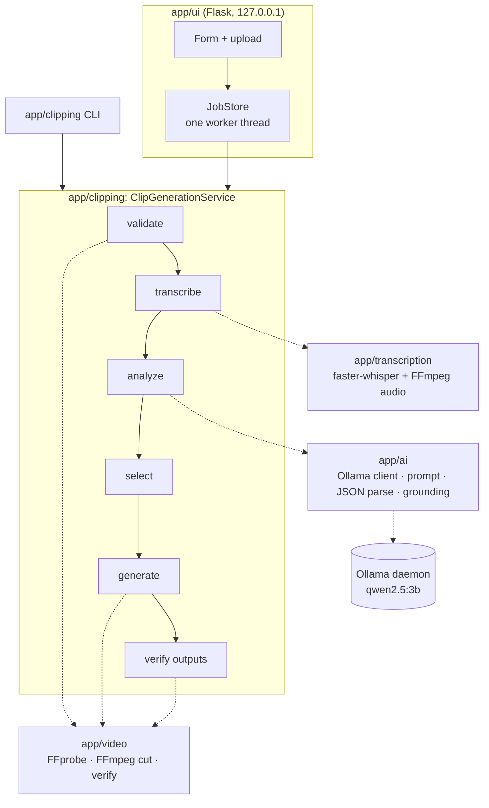

# 🏗️ Architecture

How the clipper is put together, why it's built that way, and the algorithms that matter. For the build history
see [HOW_WE_BUILT_IT.md](HOW_WE_BUILT_IT.md). For the full engineering log see [PROJECT_PROGRESS.md](PROJECT_PROGRESS.md).

- [Design principles](#-design-principles)
- [System overview](#-system-overview)
- [Modules](#-modules)
- [The pipeline, stage by stage](#-the-pipeline-stage-by-stage)
- [Timestamp grounding](#-timestamp-grounding)
- [Moment selection](#-moment-selection)
- [Exact-duration cutting](#-exact-duration-cutting)
- [Web UI internals](#-web-ui-internals)
- [Error handling](#-error-handling)
- [Security model](#-security-model)
- [Known limitations](#-known-limitations)

---

## 🧭 Design principles

| Principle | What it means in the code |
|---|---|
| **$0, local-only** | Whisper, Qwen and FFmpeg all run on your machine. No API keys, no cloud calls, no CDN assets |
| **AI suggests, Python decides, FFmpeg executes** | LLM output is untrusted text. It becomes validated floats and a quote, never a command, a path or a filename |
| **The transcript says *where*** | Clip times come from Whisper's word timestamps, found via the AI's quote. The AI's own timestamps are never used for cutting |
| **Exact or error** | Exactly N clips of exactly D seconds, each verified, or a clear error and no leftover files. Nothing is silently shortened, padded or duplicated |
| **Deterministic Python** | Ranking, windowing and de-duplication have no randomness and no second LLM pass |
| **Small, typed, tested** | ~3,500 lines of app code, frozen dataclasses, `Protocol` seams for fakes, 487 tests, `mypy` + `ruff` clean |

---

## 🗺️ System overview



The UI and the CLI are thin. **All** business rules live in `app/clipping` and the three engines below it. A test
greps the UI sources to make sure they contain no Whisper, Ollama, FFmpeg or selection logic.

---

## 📦 Modules

```
app/
├── transcription/   M02  speech → timestamped transcript
│   ├── service.py        TranscriptionService: FFmpeg audio extract → faster-whisper (CPU, int8, word timestamps)
│   ├── models.py         TranscriptionResult, TranscriptSegment, WordTimestamp (frozen dataclasses)
│   └── exceptions.py     TranscriptionError + 8 specific subclasses
├── ai/              M03  transcript + instruction → candidate moments
│   ├── client.py         OllamaClient (timeout, num_predict cap, model-present check)
│   ├── prompts.py        System/user prompt; transcript truncation for the context window
│   ├── service.py        AIReasoningService: prompt → call → strict JSON parse → validate → ground
│   ├── grounding.py      Quote → transcript position (stdlib only, ~100 lines)
│   └── models.py         ClipCandidate, ClipAnalysisResult, AIReasoningConfig.from_env()
├── video/           M04  FFprobe / FFmpeg wrapper
│   ├── ffmpeg.py         FFmpegRunner: subprocess with argument lists, never a shell
│   ├── probe.py          ffprobe JSON → VideoInfo
│   ├── service.py        VideoService.probe / extract_clip (temp → verify → atomic rename)
│   └── models.py         VideoInfo, ClipRequest, ProcessedVideo, safe_output_path()
├── clipping/        M05  the end-to-end pipeline
│   ├── service.py        ClipGenerationService.generate(): stages, status callbacks, all-or-nothing
│   ├── selection.py      validate → rank → windows → IoU filter
│   ├── windows.py        exact-duration window placement
│   └── models.py         ClipJobRequest (input limits), GeneratedClip, ClipGenerationResult, JobStatus
└── ui/              M06  local web front end
    ├── app.py            create_app(), routes, upload/form validation, safe downloads
    ├── jobs.py           Job, JobStore (single running job), worker thread, friendly_error()
    ├── config.py         UIConfig from CLIPPER_* variables
    └── templates/, static/
```

Every package has `__main__.py`, so each one is runnable as `python -m app.<module>`, and an `exceptions.py` with a
single base class.

`ClipGenerationService` depends on three `Protocol`s (`Transcriber`, `Analyzer`, `VideoEngine`), not on the
concrete classes. That is how the pipeline tests run in milliseconds with fakes, without needing Whisper, Ollama or
FFmpeg.

---

## 🔁 The pipeline, stage by stage

```
video + clip count + clip duration + instruction
  │ validating          request limits; probe source (must have audio, be ≥ clip duration);
  │                     clip_001.mp4… must not already exist
  │ transcribing        faster-whisper `small`, CPU int8, word timestamps
  │ analyzing           Qwen via Ollama → JSON candidates {start, end, reason, score, quote} → grounded
  │ selecting           Python: validate vs real source → rank → exact-duration windows → IoU filter
  │ generating          FFmpeg cut per window (sequential: only one heavy model busy at a time)
  │ validating_outputs  re-probe every clip: exists, duration within tolerance, video + audio present
  ▼ completed           ClipGenerationResult with exactly N GeneratedClip entries
```

Each transition is reported through an `on_status(JobStatus, detail)` callback. The CLI prints these to stderr, and
the UI shows them on the progress page.

---

## 📍 Timestamp grounding

**Problem (measured in M07):** `qwen2.5:3b` often found the right *moment* but gave the **wrong timestamps**, usually
those of a neighbouring segment. Cutting at the AI's times produced clips that missed the joke.

**Fix (M08):** the AI must also return an **exact quote** of 5-20 consecutive words. Python finds that quote in the
word-timestamped transcript, and the clip is placed using the **transcript's** times.

```
Transcript (word timestamps) ─┐
                              ├─> prompt → Qwen → JSON {start, end, reason, score, quote}
                              │                                  │
                              └────────> grounding.py (deterministic)
                                         quote → transcript position (word-level, else segment-level)
                                         not found / ambiguous → rejected with a reason
                                                                 │
                    ClipCandidate(start/end = transcript times, ai_start/ai_end = model's claim, for diagnostics)
```

**Algorithm (`app/ai/grounding.py`):**

1. **Normalize** the quote and the transcript into word tokens: NFKC, lower case, apostrophes unified then dropped
   (`don't` = `dont`), punctuation and whitespace ignored (`logged-out` = `logged out`). The transcript itself is
   never modified.
2. **Token stream with real times.** Each Whisper word carries its own `start`/`end`. Segments without word timestamps
   fall back to the segment's times.
3. **Exact contiguous search.** The quote must appear as consecutive tokens; it may span segments. The result runs
   from the first token's `start` to the last token's `end`.
4. **Reject, never guess:** fewer than 3 tokens, not found (paraphrased, reordered, one word different), or a
   zero-length span.
5. **Ambiguous** (the quote occurs more than once): the AI's own time may pick an occurrence only if it overlaps
   **exactly one** of them. Otherwise the candidate is rejected.
6. Rejections are logged and returned in `ClipAnalysisResult.rejected`. The other candidates continue.

**Cost:** ~26 ms to index a 2-hour transcript, plus ~6 ms per quote. That's negligible next to the AI call.

---

## ⚖️ Moment selection

`app/clipping/selection.py` turns grounded candidates into exactly N non-overlapping windows:

1. **Validate** each candidate against the probed source. Rejected: non-finite values, negative times, `end ≤ start`,
   times beyond the source, and scores outside [0, 1].
2. **Rank** by score (descending). Ties go to the length closest to the requested duration, then the earliest start.
3. **Window** (`windows.py`): exactly `clip_duration` long, centred on the candidate. Short moments gain context on
   both sides, and long ones keep their middle. A window before 0 shifts forward and one past the end shifts back.
   The start is rounded to whole milliseconds.
4. **Overlap filter:** walking down the ranking, a window is kept only if its IoU with every kept window is **≤ 0.2**.
   For equal-length clips that means sharing at most 1/3 of their length. Exact duplicates always collapse to the stronger one.
5. **Count:** stop at `clip_count`. If there are fewer distinct windows, the job fails **before rendering anything**:
   *"Only 5 sufficiently distinct candidate moments were identified; requested 6 (AI returned 8 candidates)."*

```
source  |────────────────────────────────────────────────────────────|
cand.        [██]            [██████████████]          [█]
window     [────10s────]    [────10s────]           [────10s────]   (centred, clamped to the source)
```

---

## 🎞️ Exact-duration cutting

`VideoService.extract_clip(input, output, start, duration)`:

```
1. validate request     start ≥ 0, duration > 0, both finite
2. probe source         ffprobe -show_format -show_streams -of json
3. bounds check         start + duration ≤ source duration  (else ClipDurationError, never shortened)
4. encode to temp       <out dir>/.partial-XXXX.mp4
5. probe + validate     |actual − requested| ≤ max(0.05 s, 1 frame); audio kept if the source had it
6. os.replace           temp → final name (atomic; no overwrite unless asked)
```

- **Always re-encode.** Stream copy can only cut on keyframes, which gives unpredictable durations. `-ss` before
  `-i` with re-encoding is frame-accurate and doesn't decode the file up to `start`.
- **Output:** H.264 (`libx264`, preset `medium`, CRF 23, `yuv420p`) + AAC 192k, MP4 with `+faststart`. It plays
  everywhere.
- **Measured** on FFmpeg 9.0.2: maximum error **0.023 s** (30 and 23.976 fps sources); many clips are exact.
- No audio in the source → video-only output. A silent track is never invented.

---

## 🌐 Web UI internals

| Route | Purpose |
|---|---|
| `GET /` | Form |
| `POST /jobs` | Validate → stream upload to disk → FFprobe → start the job → `303` to `/jobs/<id>` |
| `GET /jobs/<id>` | Progress (meta-refresh every 3 s, no JS polling), result, or error page |
| `GET /jobs/<id>/clips/<name>` | Download one clip |

- **Concurrency:** M05 is synchronous, so the UI runs each job in one daemon thread. Only one job runs at a time; a
  second submit gets HTTP 409. This keeps the browser from waiting minutes on a single request.
- **Storage:** `job_id = uuid4().hex`. Uploads go to `input/ui_uploads/<id>/source.<ext>` and clips to
  `output/ui_jobs/<id>/`. The client's filename is only displayed (escaped, basename, ≤ 120 chars), never used as a path.
- **Cleanup:** the upload is always deleted when the job ends. A failed job also removes its output folder. Orphaned
  upload folders are removed on startup.

---

## 🧯 Error handling

Each engine raises subclasses of its own base error. M05 wraps them into **stage** errors (`TranscriptionStageError`,
`AnalysisStageError`, `ClipRenderError(index)`, `OutputVerificationError(index)`, `InsufficientCandidatesError`, …),
keeping the original as `__cause__`.

The UI's `friendly_error()` maps those to **fixed** sentences such as *"Ollama is not running. Start Ollama and try
again."* Raw exception text is never shown, because it can contain absolute paths or FFmpeg output. The details go
to the server log.

**All-or-nothing:** if clip 7 fails to render or verify, clips 1-6 of that job are deleted. Unrelated files are not touched.

---

## 🔒 Security model

| Threat | Mitigation |
|---|---|
| Prompt injection via the focus text or the speech | LLM output is parsed as strict JSON into floats and strings. It never reaches a shell, a path or a filename. Times come from the transcript, not the model |
| Shell injection | `subprocess` with argument lists only, never `shell=True`. The UI contains no subprocess calls (test-enforced) |
| Path traversal | Generated names (`uuid4`, `clip_NNN.mp4`), `safe_output_path()`, `pathlib` containment checks |
| Arbitrary file download | Download only if `job_id` matches `^[0-9a-f]{32}$`, `name` matches `^clip_\d{3}\.mp4$` **and** is in that job's results, and the path resolves inside the job folder |
| Malicious uploads | Extension allowlist **plus** an FFprobe container check, a size limit, streaming to disk |
| Network exposure | Binds to `127.0.0.1` by default. Debug is off. `0.0.0.0` needs an explicit opt-in and logs a warning |
| XSS | Jinja autoescaping for all AI text and filenames |
| Data leaving the machine | No external calls, except the one-time Whisper model download from Hugging Face |

Not provided (acceptable for a single-user localhost tool): authentication, CSRF tokens and HTTPS.

---

## ⚠️ Known limitations

1. **Speech only.** Moments come from the transcript; visual-only or music-only content is invisible.
2. **One job at a time**, no cancellation from the browser, and job status lives in memory.
3. **CPU speed.** `qwen2.5:3b` takes ~1-8 min per job, and longer on list-like requests ("all decisions").
4. **AI variance.** At temperature 0.1 the same video can give different picks between runs.
5. Each job reloads the Whisper model (a few seconds).
6. There's no in-browser preview player; you download the clips.
