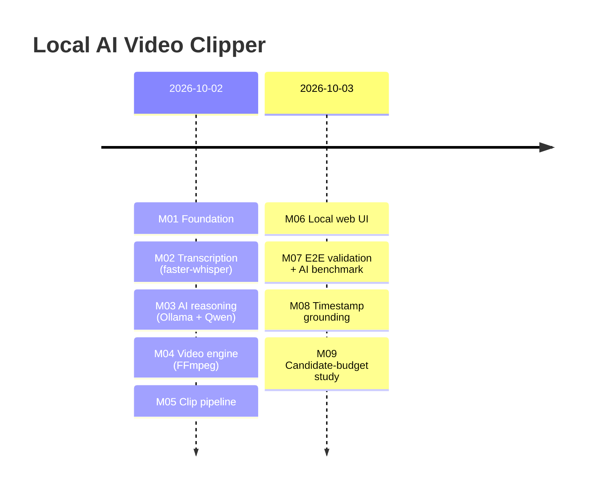

# 📜 How We Built It

The story of the Local AI Video Clipper from an empty folder to a measured, tested product, in nine milestones
over two days (2026-10-02 → 2026-10-03). Each milestone ended with passing tests, clean `ruff`/`mypy`, a real
manual check, and one commit.

> The full per-milestone engineering log (every test count, measurement and decision) is
> [PROJECT_PROGRESS.md](PROJECT_PROGRESS.md). This page is the readable summary.

---

## 🎯 The goal

> *Take a video, a clip count, a clip duration and an optional instruction, and produce that many clips of exactly
> that duration, chosen by AI. **Cost: $0.** No paid APIs, no subscriptions, no cloud AI, no paid GPU, no mandatory SaaS.*

That one constraint decided the stack:

| Need | Choice | Why |
|---|---|---|
| Speech → text with timestamps | **faster-whisper** (`small`, CPU int8) | Free, offline, word-level timestamps, fast on CPU via CTranslate2 |
| "Which moments match?" | **Ollama + Qwen 2.5** | Free local LLMs, simple HTTP API, small models that run on 16 GB RAM |
| Probe, cut and verify video | **FFmpeg / FFprobe** via `subprocess` | The standard; frame-accurate; no Python wrapper dependency |
| UI | **Flask** | Tiny, server-rendered, no JS build step, no CDN |
| Quality | **pytest, ruff, mypy** | Fast feedback; strict types on every module |

---

## 🧱 Milestone timeline

| # | Milestone | Commit | Tests after |
|---|---|---|---|
| M01 | Foundation | `e64004b` | - |
| M02 | Transcription engine | `63ac5e4` | 46 |
| M03 | AI reasoning module | `5c9e53a` | 114 |
| M04 | Video processing engine | `6fe31a9` | 227 |
| M05 | Automatic clip pipeline | `11d7970` | 310 |
| M06 | Local web UI | `8db22a8` | 395 |
| M07 | End-to-end validation & AI benchmark | `aa5da88` | 440 |
| M08 | Timestamp grounding | `7ac83ce` | 487 |
| M09 | Candidate-budget experiment | `02457e8` | 488 (487 + 1 opt-in) |

---

### M01: Foundation
Project layout (`app/`, `tests/`, `docs/`, `input/`, `output/`), a virtual environment, minimal dev dependencies
(pytest, ruff, mypy, python-dotenv), `.gitignore` for media and models, and `PROJECT_PROGRESS.md` as the single
source of truth.

### M02: Transcription engine
- FFmpeg extracts mono 16 kHz audio, using a safe argument-list `subprocess` call.
- faster-whisper `small` on CPU with `int8` produces **word-level timestamps**.
- Typed frozen dataclasses: `TranscriptionResult` → `TranscriptSegment` → `WordTimestamp`.
- 9 specific exceptions (missing file, unsupported format, FFmpeg missing, empty audio, …).
- *Decision:* `small` is the best accuracy/speed balance on CPU. `tiny`/`base` miss too much, and `medium`+ is too slow.

### M03: AI reasoning
- `OllamaClient` with lazy connection, so tests and imports never need the daemon.
- A prompt that demands **strict JSON only**: `{start, end, reason, score}` per candidate.
- Every candidate is validated: finite, ≥ 0, `end > start`, inside the transcript, score in [0, 1]. Invalid ones are skipped, not fatal.
- Deterministic sort (score desc, start asc), up to 20 candidates, transcript truncation for the context window.
- *Decision at the time:* `qwen2.5:0.5b` as the default for speed. **M07 later proved this wrong.**

### M04: Video engine
- FFprobe → typed `VideoInfo` for MP4, MKV, MOV, AVI and WebM.
- **Always re-encode** (keyframe-only stream copy can't hit exact durations), with `-ss` before `-i`.
- Temp file → re-probe → reject if off by more than `max(0.05 s, 1 frame)` → atomic `os.replace`.
- Clips past the source end raise an error. They are **never silently shortened**.
- `python -m app.video selftest` builds synthetic videos and measured a maximum error of **0.023 s**.

### M05: Automatic clip pipeline
The modules joined into `ClipGenerationService.generate()`:
validate → transcribe → analyze → select → generate → verify.
- **Selection in pure Python:** rank, centred exact-duration windows clamped to the source, IoU ≤ 0.2 overlap filter.
- **All-or-nothing:** too few distinct moments → fail before rendering. Any clip fails → delete that job's clips.
- `Protocol` seams let 82 pipeline tests run with fakes in milliseconds.
- First real end-to-end run: a 70 s video → 3 clips in ~41 s.

### M06: Local web UI
- Flask on `127.0.0.1`: form → background worker thread → progress page (meta refresh) → results with downloads.
- Uploads stream to disk, are checked by extension **and** FFprobe, and are deleted when the job ends.
- Hardened downloads (regex names, job membership, path containment) and fixed friendly error messages.
- A test greps the UI to make sure it contains no Whisper/Ollama/FFmpeg/selection logic, so the UI stays thin.

### M07: End-to-end validation and AI quality benchmark
This was the "does it actually work?" milestone, and it was humbling.
- A **real E2E harness** (`benchmarks/e2e/run_real_e2e.py`) with per-stage timings, plus a synthesized 147 s speech
  video made with Windows' built-in voice.
- An **AI benchmark** (`benchmarks/ai/`): a labelled synthetic meeting transcript (17 segments, each with a known
  category), 4 tasks, 3 runs each, with every metric computed automatically.
- **Findings:**
  - `qwen2.5:0.5b` does **no semantic selection**: top-1 correct **0/12**, real E2E **0/3**. It lists everything with one constant score.
  - `qwen2.5:3b` gets the right moment **9/12** times, and real E2E **3/3**, but often attaches the **wrong timestamps**.
- **Bugs found by measuring:** the transcript duration was always 0.0, wrong-shaped AI JSON crashed the service, and
  the model-tag check was wrong. Each fix got a regression test.

### M08: Timestamp grounding
Fixing "right words, wrong time":
- The default model became **`qwen2.5:3b`**.
- The AI must return an **exact quote**. `app/ai/grounding.py` (~100 lines, stdlib only) finds it in the
  word-timestamped transcript, and **that** position is where the clip is cut. Quotes that aren't found or are
  ambiguous are rejected with a reason. There is no fuzzy matching and no guessing.
- Four prompt variants were measured. Asking for the quote **last** kept ranking accuracy at 9/12. Asking for it first
  dropped it to 3/12, and a sentence-like example made the model copy the example into every answer.
- Robustness: an output-token cap (`AI_MAX_OUTPUT_TOKENS=3072`), because 0.5b could loop until the 600 s timeout.

### M09: Candidate-budget experiment (a negative result, kept honestly)
*Question:* asking the AI for fewer candidates when the user wants fewer clips should be faster. Does it lose quality?
- Budgets of 3-20 were benchmarked (72 calls), then replayed on a **real** Whisper transcript.
- The synthetic benchmark suggested a budget of 8 was fine. **The real transcript overturned that:** budget 20 ranked
  the joke first in 4/4 runs and budget 8 in 0/4, and budget 20 was also the fastest there.
- The change was implemented, tested, then **reverted**. Production code is byte-identical to M08. Only the measuring
  tools (`--budgets`, per-clip-count metrics) were kept.

---

## 🧠 What we learned

1. **Measure the AI, don't trust it.** The model that "worked" in a manual check (0.5b) turned out to select nothing.
   Only a labelled benchmark showed this.
2. **Make the AI do the part it's good at.** LLMs recognise *what* is funny; they're bad at *where* it is in seconds.
   Splitting the job (AI: quote, Python: position) fixed the biggest quality problem with ~100 lines of stdlib code.
3. **Real data beats synthetic data.** M09's conclusion flipped on one real transcript.
4. **Negative results are results.** M09 shipped no feature, and that was the correct outcome.
5. **Exact or error.** Refusing to pad, shorten or duplicate clips made failures visible and fixable instead of silent.
6. **Thin edges, thick core.** All rules live in one place (`app/clipping`), so the UI and CLI can't drift apart.

---

## 🔮 What's next (not started)

- A faster AI step: a different model or runtime, re-measured with `--budgets` plus the real-transcript check.
- V1 features kept out of scope so far: burned-in captions, 9:16 vertical reframing, an in-browser preview, a job queue.
