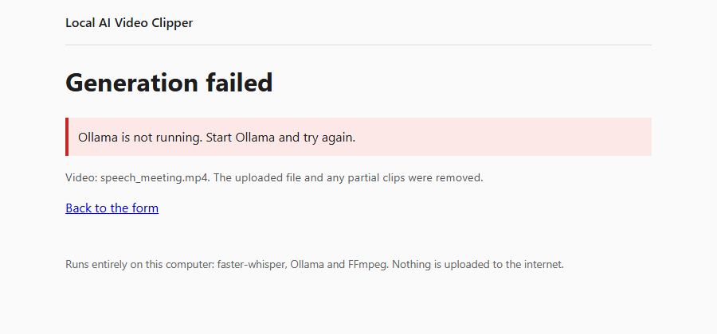

# 📦 Setup Guide

This guide takes you from a fresh computer to your first generated clip, one step at a time. After each step there's
a **✅ Check** you can run, so problems surface where they start and not three steps later.

- [0. What you will install](#0-what-you-will-install)
- [1. Python](#1-python-310-or-newer)
- [2. FFmpeg](#2-ffmpeg--ffprobe)
- [3. Ollama and the Qwen model](#3-ollama-and-the-qwen-model)
- [4. Get the code](#4-get-the-code)
- [5. Virtual environment and Python packages](#5-virtual-environment-and-python-packages)
- [6. Verify the whole stack](#6-verify-the-whole-stack)
- [7. First run](#7-first-run)
- [8. Configuration](#8-configuration)
- [9. Troubleshooting](#9-troubleshooting)
- [10. Updating, cleaning up, uninstalling](#10-updating-cleaning-up-uninstalling)

---

## 0. What you will install

| Component | Version tested | Why it's needed | Disk |
|---|---|---|---|
| Python | 3.10.11 (3.10+ required) | Runs the app | ~100 MB |
| FFmpeg + FFprobe | 9.0.2 | Reads videos, extracts audio, cuts clips | ~200 MB |
| Ollama | 0.32.15 | Runs the local LLM | ~1 GB |
| `qwen2.5:3b` model | - | Finds the moments (default model) | 1.9 GB |
| Python packages | see `requirements.txt` | faster-whisper, CPU PyTorch, Flask, ollama client, dev tools | ~1 GB |
| Whisper `small` model | - | Speech-to-text; downloaded automatically on first use | ~480 MB |

**Total:** about **4-5 GB** of disk. **RAM:** 8 GB minimum, 16 GB recommended for `qwen2.5:3b`.
**GPU:** not required. Everything runs on the CPU.

**Internet** is needed only during setup: Python packages, the Ollama model, and the one-time Whisper download from
Hugging Face. After that the app runs fully offline.

> Commands below are shown for **Windows (PowerShell)** first, then **macOS** and **Linux**. Run them in a terminal.

---

## 1. Python 3.10 or newer

**Windows**
```powershell
winget install Python.Python.3.10
```
Or download it from <https://www.python.org/downloads/> and **tick "Add python.exe to PATH"** in the installer.

**macOS**
```bash
brew install python@3.10
```

**Linux (Debian/Ubuntu)**
```bash
sudo apt update && sudo apt install python3 python3-venv python3-pip
```

**✅ Check:** open a *new* terminal and run
```bash
python --version      # macOS/Linux may need: python3 --version
```
You should see `Python 3.10.x` or newer.

---

## 2. FFmpeg + FFprobe

One install gives you both tools.

**Windows**
```powershell
winget install Gyan.FFmpeg
```
Then **close and reopen the terminal**. `winget` updates `PATH`, but terminals that are already open won't see the change.

**macOS**
```bash
brew install ffmpeg
```

**Linux**
```bash
sudo apt install ffmpeg
```

**✅ Check:**
```bash
ffmpeg -version
ffprobe -version
```
Both should print a version banner. If you get *"not recognized"* / *"command not found"*, see [Troubleshooting](#ffmpeg-is-not-installed-or-not-on-path).

---

## 3. Ollama and the Qwen model

1. Install Ollama:
   - **Windows / macOS:** download from <https://ollama.com/download> and run the installer.
   - **Linux:** `curl -fsSL https://ollama.com/install.sh | sh`
2. Make sure it's running. On Windows and macOS the tray app starts it for you. You can also start it by hand:
   ```bash
   ollama serve
   ```
   (Leave that terminal open, or let the tray app run it in the background.)
3. Download the default model, **one time** (~1.9 GB):
   ```bash
   ollama pull qwen2.5:3b
   ```
   Optional faster but weaker model: `ollama pull qwen2.5:0.5b` (~400 MB).

**✅ Check:**
```bash
ollama list                                  # qwen2.5:3b should be listed
curl http://localhost:11434/api/version      # {"version":"..."}
```

> The app **never** downloads models by itself. If the model is missing, the UI tells you which `ollama pull` to run.

---

## 4. Get the code

```bash
git clone https://github.com/ayushrijal83-ops/video_scliser.git
cd video_scliser
```

No Git? Download the ZIP from GitHub (**Code → Download ZIP**), extract it, and `cd` into the folder.

---

## 5. Virtual environment and Python packages

A virtual environment keeps this project's packages apart from everything else on your machine.

**Windows (PowerShell)**
```powershell
python -m venv .venv
.venv\Scripts\Activate.ps1
```
> If PowerShell blocks the script, run this once:
> `Set-ExecutionPolicy -Scope CurrentUser RemoteSigned`. Or use `cmd.exe` and `.venv\Scripts\activate.bat`.

**macOS / Linux**
```bash
python3 -m venv .venv
source .venv/bin/activate
```

Your prompt should now start with `(.venv)`. Then install the packages:

```bash
python -m pip install --upgrade pip
pip install -r requirements.txt
```

This takes a few minutes. `requirements.txt` installs the **CPU-only** build of PyTorch from
`download.pytorch.org/whl/cpu`, so no CUDA download is involved.

**✅ Check:**
```bash
python -c "import faster_whisper, flask, ollama; print('packages OK')"
```

> Every later command assumes the venv is **active**. In a new terminal, activate it again first (step 5).

---

## 6. Verify the whole stack

Run these in order. Each one tests one more layer.

```bash
# 1. Unit tests (no Ollama/Whisper needed; the FFmpeg test runs only if FFmpeg is on PATH)
pytest -q
#   → 487 passed, 1 skipped

# 2. Real FFmpeg check: builds synthetic videos in all 5 containers and cuts exact clips
python -m app.video selftest

# 3. Full real pipeline (Windows only: makes a 147 s speech video with the built-in Windows voice)
python -m benchmarks.e2e.run_real_e2e --synthesize -n 3 -d 10 -i "funny moments"
#   On macOS/Linux, use any speech video instead:
#   python -m benchmarks.e2e.run_real_e2e --video path/to/talk.mp4 -n 2 -d 15
```

The third command is the real proof: Whisper, Qwen and FFmpeg working together. It prints per-stage timings, exits
with code `0`, and writes the clips plus `report.json` to `output/e2e/<timestamp>/`. The **first** run also downloads
the Whisper `small` model (~480 MB) from Hugging Face.

---

## 7. First run

### Option A: Windows one-click (`start.bat`)

Double-click **`start.bat`** in the project folder. It:
1. starts `ollama serve` minimized, if it isn't already running
2. pulls `qwen2.5:3b` if it's missing
3. activates `.venv`
4. opens <http://127.0.0.1:5000/> in your browser after a few seconds
5. runs the web app (close the window to stop it)

> `start.bat` assumes steps 1-5 are already done. It does not create the venv or install packages.

### Option B: any OS

```bash
python -m app.ui
# Local AI Video Clipper: http://127.0.0.1:5000/
```

Open **<http://127.0.0.1:5000/>** and then:

1. **Choose a video** (MP4, MKV, MOV, AVI or WebM, up to 2 GB). It must contain speech.
2. Set the **number of clips** (1-20) and the **duration per clip** in seconds (1-600).
3. Optionally type a **focus**, e.g. *funny moments*. The default is *interesting moments*.
4. Press **Generate Clips**.


The processing page refreshes every 3 seconds and shows the real stage:


When it finishes, each clip shows its timecodes, AI score and reason, and has a **Download** button:


Clips are saved to `output/ui_jobs/<job-id>/clip_001.mp4 …`. They stay there until you delete them.

---

## 8. Configuration

All settings are **environment variables** with safe defaults. You only need to set the ones you want to change.

| Variable | Default | What it does |
|---|---|---|
| `OLLAMA_MODEL` | `qwen2.5:3b` | Which Ollama model picks the moments |
| `OLLAMA_HOST` | `http://localhost:11434` | Where Ollama is listening |
| `OLLAMA_TIMEOUT` | `600` | Seconds allowed per AI call |
| `AI_MAX_OUTPUT_TOKENS` | `3072` | Caps the AI's answer length, which bounds worst-case time |
| `AI_MAX_CANDIDATES` | `20` | Maximum moments the AI may propose |
| `AI_TEMPERATURE` | `0.1` | Lower values give more repeatable answers |
| `CLIPPER_HOST` | `127.0.0.1` | Web UI bind address (localhost only) |
| `CLIPPER_PORT` | `5000` | Web UI port |
| `CLIPPER_UPLOAD_DIR` | `input/ui_uploads` | Temporary upload folder |
| `CLIPPER_OUTPUT_DIR` | `output/ui_jobs` | Where clips are written |
| `CLIPPER_MAX_UPLOAD_MB` | `2048` | Upload size limit |
| `CLIPPER_DEBUG` | off | `1` enables Flask debug mode (local development only) |

**How to set one:**

```powershell
# Windows PowerShell (this terminal only)
$env:OLLAMA_MODEL = "qwen2.5:0.5b"
$env:CLIPPER_PORT = "8080"
python -m app.ui
```

```bash
# macOS / Linux / Git Bash
OLLAMA_MODEL=qwen2.5:0.5b CLIPPER_PORT=8080 python -m app.ui
```

> ⚠️ **Network access:** setting `CLIPPER_HOST=0.0.0.0` makes the UI reachable from other devices. There is **no
> login and no HTTPS**, so only do this on a network you trust. The app logs a warning when you do.

---

## 9. Troubleshooting

When a job fails, the UI shows a plain-language message. It never shows paths or tracebacks. The uploaded file and
any partial clips are removed.



The full technical detail is in the terminal where `python -m app.ui` is running.

| Message / symptom | Cause | Fix |
|---|---|---|
| **Ollama is not running. Start Ollama and try again.** | The Ollama server isn't reachable at `OLLAMA_HOST` | Start the Ollama app or run `ollama serve`. Check with `curl http://localhost:11434/api/version` |
| **The Qwen model is unavailable. Run: ollama pull …** | The model hasn't been downloaded | Run the `ollama pull` command shown in the message |
| <a id="ffmpeg-is-not-installed-or-not-on-path"></a>**FFmpeg is not installed or not on PATH.** | FFmpeg missing, or the terminal was opened before installing it | Install FFmpeg (step 2), then **open a new terminal** |
| **The video has no audio track.** | Moments are found from speech | Use a video that contains speech |
| **The video is X seconds long, shorter than the requested clip duration** | Clip longer than the video | Lower the duration |
| **Only N sufficiently distinct moments were found** | Not enough separate matching moments | Ask for fewer or shorter clips, or broaden the focus. Re-running can also help, since AI output varies |
| **Transcription failed** | Unreadable audio, or faster-whisper not installed | Check the video plays with sound, and that `pip install -r requirements.txt` succeeded |
| **Another job is still running. Please wait for it to finish.** | One job at a time (CPU-bound) | Wait for the current job to finish |
| First job is very slow | One-time Whisper model download (~480 MB) | Wait. Later runs use the cache |
| AI step takes many minutes | `qwen2.5:3b` on CPU writes long lists for some requests | Normal (up to ~8 min). For speed, use `OLLAMA_MODEL=qwen2.5:0.5b` (lower quality) |
| `Address already in use` / port 5000 busy | Another program uses the port | `CLIPPER_PORT=8080` |
| `Activate.ps1 cannot be loaded` | PowerShell execution policy | `Set-ExecutionPolicy -Scope CurrentUser RemoteSigned` |
| `pip` can't find `torch` | Python version too new or too old for the CPU wheels | Use Python 3.10-3.12 |
| `huggingface.co` connection error | No internet on the first transcription | Connect once so the Whisper model can download, then you can work offline |

**Debug logging** for any CLI: add `-v`, e.g. `python -m app.clipping video.mp4 -n 1 -d 10 -i test -v`.

---

## 10. Updating, cleaning up, uninstalling

**Update**
```bash
git pull
pip install -r requirements.txt
```

**Free disk space.** Everything generated lives in two git-ignored folders:

| Folder | Contents | Safe to delete? |
|---|---|---|
| `output/ui_jobs/` | Clips made in the web UI | Yes, once you've saved what you want |
| `output/e2e/`, `output/benchmarks/` | Test and benchmark runs | Yes |
| `input/ui_uploads/` | Temporary uploads (normally removed automatically) | Yes, while the app is stopped |

**Uninstall**
1. Delete the project folder (this also removes `.venv`).
2. Remove the models: `ollama rm qwen2.5:3b` (and `qwen2.5:0.5b`, if you pulled it).
3. Remove the Whisper cache: `~/.cache/huggingface/hub/models--Systran--faster-whisper-small`
   (on Windows: `%USERPROFILE%\.cache\huggingface\hub\…`).
4. Optionally uninstall Ollama and FFmpeg (`winget uninstall Ollama.Ollama` / `winget uninstall Gyan.FFmpeg`).
